# hey, I'm Daniil 👋

**Building AI-native apps for Apple platforms**

---

### What I'm building

**[Fable](https://github.com/Engineer9118brov2/Fable)** — a native iOS · macOS · watchOS AI assistant powered by [OpenClaw](https://github.com/openclaw-ai/openclaw).

- Multi-agent chat with a **conductor pattern** — Scribe orchestrates cloud sub-agents (GLM, MiniMax, Claude)
- **40+ built-in tools** — Calendar, Contacts, Files, Web search, GitHub, Reminders, Hyperliquid DeFi, and more
- Long-term per-agent memory, live calendar context, full macOS system integration
- Privacy-first: runs locally on Ollama by default, cloud models optional

---

### Stack

---

### Activity

<!-- Updated daily by GitHub Actions — always accurate -->

---

### Support

If Fable is useful — [**sponsor the project**](https://github.com/sponsors/Engineer9118brov2) ☕

---

Always building · Encino, LA · engineer9118@gmail.com
